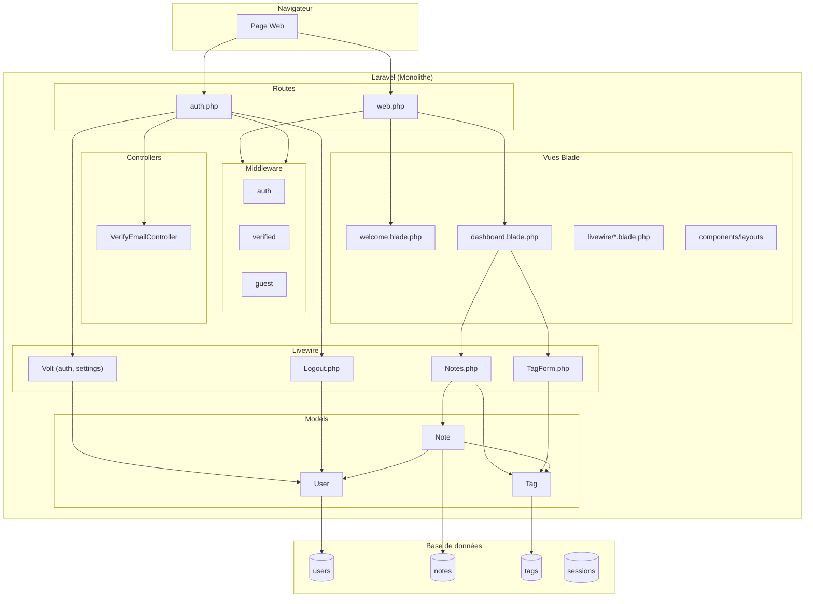
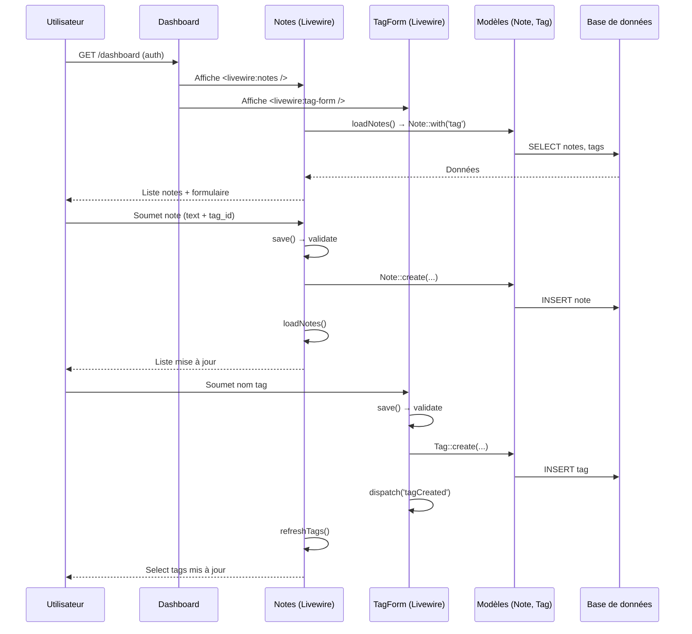
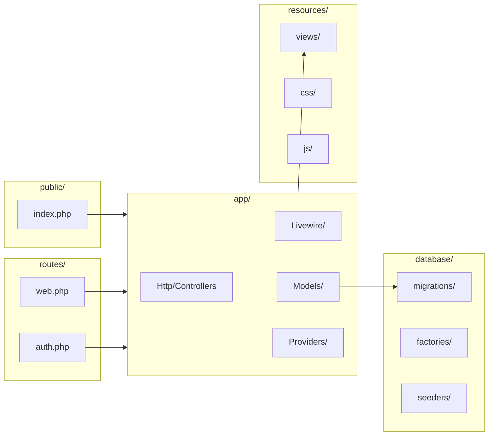
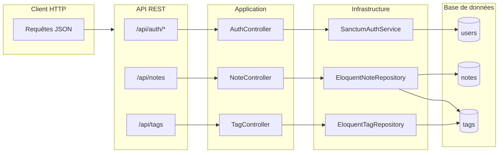

<<<<<<< HEAD
# Analyse de l'application Renote

## 1. Fonctionnalités principales et fichiers associés

### Vue d'ensemble

**Renote** est une application de prise de notes permettant aux utilisateurs authentifiés de créer, consulter et supprimer des notes, et d’associer des tags. L’application repose sur une architecture monolithique Laravel avec Livewire pour l’interface réactive.

---

### 1.1 Page d’accueil (non authentifiée)

| Rôle | Description |
|------|-------------|
| **Fichiers** | `routes/web.php`, `resources/views/welcome.blade.php` |
| **Comportement** | Affiche la landing « Renote » avec liens Login / Register ou Dashboard selon l’état de connexion. |

- **Route** : `GET /` → nommée `home`
- **Vue** : `welcome.blade.php` (présentation, logo, navigation conditionnelle `@auth` / `@guest`)

---

### 1.2 Authentification

| Fonctionnalité | Fichiers utilisés | Description |
|----------------|-------------------|-------------|
| **Inscription** | `routes/auth.php`, Volt → `resources/views/livewire/auth/register.blade.php` | Formulaire d’inscription (Volt) |
| **Connexion** | `routes/auth.php`, Volt → `resources/views/livewire/auth/login.blade.php` | Formulaire de connexion (Volt) |
| **Déconnexion** | `routes/auth.php`, `app/Livewire/Actions/Logout.php` | POST `/logout` → invalidation session, redirection `/` |
| **Mot de passe oublié** | `routes/auth.php`, Volt → `resources/views/livewire/auth/forgot-password.blade.php` | Demande de réinitialisation |
| **Réinitialisation mot de passe** | `routes/auth.php`, Volt → `resources/views/livewire/auth/reset-password.blade.php` | Formulaire avec token |
| **Vérification email** | `routes/auth.php`, `app/Http/Controllers/Auth/VerifyEmailController.php`, Volt → `verify-email.blade.php` | Notice + contrôleur pour le lien signé |
| **Confirmation mot de passe** | `routes/auth.php`, Volt → `resources/views/livewire/auth/confirm-password.blade.php` | Confirmation avant action sensible |

- **Modèle** : `app/Models/User.php` (Authenticatable, HasFactory, Notifiable, `initials()`)
- **Migrations** : `database/migrations/0001_01_01_000000_create_users_table.php` (users, password_reset_tokens, sessions)

---

### 1.3 Dashboard (zone authentifiée)

| Rôle | Fichiers utilisés | Description |
|------|-------------------|-------------|
| **Route** | `routes/web.php` | `GET /dashboard` → middleware `auth`, `verified` |
| **Vue principale** | `resources/views/dashboard.blade.php` | Layout app + composants Livewire Notes et TagForm |
| **Layout** | `resources/views/components/layouts/app.blade.php` → `components/layouts/app/sidebar.blade.php` | Sidebar Flux (nav, menu utilisateur, liens Settings / Logout) |

Le dashboard est la page centrale une fois connecté : elle affiche la gestion des notes et des tags.

---

### 1.4 Gestion des notes

| Action | Fichiers utilisés | Description |
|--------|-------------------|-------------|
| **Composant Livewire** | `app/Livewire/Notes.php` | État : `notes`, `text`, `tag_id`, `tags`. Méthodes : `mount()`, `loadNotes()`, `save()`, `delete()`, `refreshTags()`. Écoute `tagCreated`. |
| **Vue** | `resources/views/livewire/notes.blade.php` | Formulaire (textarea + select tag), liste des notes, bouton supprimer par note |
| **Modèle** | `app/Models/Note.php` | Fillable : `user_id`, `tag_id`, `text`. Relations : `user()`, `tag()` |
| **Migration** | `database/migrations/2025_07_16_195507_create_notes_table.php` | Table `notes` (user_id, tag_id, text, FK users/tags) |
| **Factory** | `database/factories/NoteFactory.php` | Données de test |

- Les notes sont filtrées par `user_id` (Auth::id()).
- Une note est liée à un tag obligatoire (validation `tag_id` required|exists:tags,id).

---

### 1.5 Gestion des tags

| Action | Fichiers utilisés | Description |
|--------|-------------------|-------------|
| **Composant Livewire** | `app/Livewire/TagForm.php` | Champ `name`, validation (required, max:50, unique:tags,name), `save()` → création + `dispatch('tagCreated')` |
| **Vue** | `resources/views/livewire/tag-form.blade.php` | Formulaire « Add a tag » + affichage erreurs |
| **Modèle** | `app/Models/Tag.php` | Fillable : `name`. Relation : `notes()` |
| **Migration** | `database/migrations/2025_07_16_195813_create_tags_table.php` | Table `tags` (name) |
| **Factory** | `database/factories/TagFactory.php` | Données de test |

- Les tags sont globaux (pas de `user_id`) ; toute note doit choisir un tag existant.
- Création d’un tag → événement Livewire `tagCreated` pour rafraîchir la liste des tags dans `Notes`.

---

### 1.6 Paramètres utilisateur (Settings)

| Page | Fichiers utilisés | Description |
|------|-------------------|-------------|
| **Profil** | `routes/web.php`, Volt → `resources/views/livewire/settings/profile.blade.php` | `settings/profile` |
| **Mot de passe** | `routes/web.php`, Volt → `resources/views/livewire/settings/password.blade.php` | `settings/password` |
| **Apparence** | `routes/web.php`, Volt → `resources/views/livewire/settings/appearance.blade.php` | `settings/appearance` |
| **Suppression compte** | Volt → `resources/views/livewire/settings/delete-user-form.blade.php` | Formulaire de suppression du compte |

- Redirection : `GET /settings` → `settings/profile`.
- Layout settings : `resources/views/components/settings/layout.blade.php`, `partials/settings-heading.blade.php`.

---

### 1.7 Routes Notes / Tags (UI)

- `routes/web.php` : `Route::view('/notes', 'dashboard')` et `Route::view('/tags', 'dashboard')` (middleware `auth`).
- Les URLs `/notes` et `/tags` affichent le même dashboard ; la logique métier (notes + tags) est dans le dashboard via les composants Livewire.

---

### 1.8 Récapitulatif par couche

| Couche | Fichiers principaux |
|--------|----------------------|
| **Routes** | `routes/web.php`, `routes/auth.php` |
| **Controllers** | `app/Http/Controllers/Controller.php`, `app/Http/Controllers/Auth/VerifyEmailController.php` |
| **Livewire** | `app/Livewire/Notes.php`, `app/Livewire/TagForm.php`, `app/Livewire/Actions/Logout.php` |
| **Modèles** | `app/Models/User.php`, `app/Models/Note.php`, `app/Models/Tag.php` |
| **Vues** | `resources/views/dashboard.blade.php`, `resources/views/welcome.blade.php`, `resources/views/livewire/*.blade.php`, `resources/views/components/layouts/**` |
| **Migrations** | `database/migrations/*_create_users_table.php`, `*_create_notes_table.php`, `*_create_tags_table.php`, cache, jobs |

---

## 2. Langages et frameworks

### Backend

| Technologie | Version / détail | Rôle |
|-------------|------------------|------|
| **PHP** | ^8.2 | Langage serveur |
| **Laravel** | ^12.0 | Framework MVC, routing, auth, ORM, migrations, config |
| **Livewire** | (via Volt) | Composants réactifs côté serveur, pas de SPA JS |
| **Livewire Volt** | ^1.7.0 | Composants Volt (single-file) pour routes et vues auth/settings |
| **Livewire Flux** | ^2.1.1 | Composants UI (sidebar, navlist, dropdown, etc.) |

### Frontend

| Technologie | Version / détail | Rôle |
|-------------|------------------|------|
| **Blade** | (Laravel) | Moteur de templates (vues, composants, layouts) |
| **Tailwind CSS** | ^4.0.7 | Styles utilitaires, thème clair/sombre |
| **Vite** | ^6.0 | Build et dev (CSS/JS), intégration Laravel |
| **Laravel Vite Plugin** | ^1.0 | Intégration Vite dans Laravel |
| **Axios** | ^1.7.4 | Requêtes HTTP (dépendance projet) |

### Base de données et outillage

| Technologie | Rôle |
|-------------|------|
| **Eloquent** | ORM Laravel (User, Note, Tag) |
| **Migrations Laravel** | Schéma BDD (users, sessions, cache, jobs, notes, tags) |
| **Pest** | ^3.8 — Tests (Feature + Unit) |
| **Laravel Pint** | Linting / formatage PHP |
| **Faker** | Données factices (factories) |

### Résumé

- **Langages** : PHP (backend), HTML/Blade, CSS (Tailwind), JavaScript minimal (Vite/axios).
- **Frameworks** : Laravel 12 (backend), Livewire + Volt + Flux (UI réactive et composants).
- **Style** : Tailwind CSS 4, build avec Vite 6.

---

## 3. Schéma de l’architecture

Les diagrammes ci-dessous sont au format **Mermaid** : ils s’affichent automatiquement sur GitHub, GitLab et dans de nombreux éditeurs (VS Code avec extension Mermaid, Cursor, etc.). Vous pouvez aussi les exporter en image via [mermaid.live](https://mermaid.live).

### 3.1 Schéma global (Mermaid)



### 3.2 Flux des données (Notes / Tags)



### 3.3 Structure des dossiers (couches)



### 3.4 Modèle de données (entités)
=======
# Analyse de l'application Architecture Cible (API Renote)

## 1. Fonctionnalité principale et fichiers associés

### Vue d'ensemble

L'application est une **API REST** de prise de notes : les utilisateurs s'authentifient par token (Laravel Sanctum), puis peuvent gérer des **notes** (texte + tag obligatoire) et des **tags** (globaux). Il n'y a pas d'interface web : tout accès se fait via des requêtes HTTP vers les routes préfixées par `/api`.

---

### 1.1 Authentification (API)

| Action | Méthode | Route | Fichiers | Description |
|--------|---------|--------|----------|-------------|
| Connexion | `POST` | `/api/auth/login` | `routes/api.php`, `AuthController::login`, `LoginRequest`, `AuthServiceInterface`, `SanctumAuthService` | Email + mot de passe → token + user (JSON). Réponse 401 si identifiants invalides. |
| Déconnexion | `POST` | `/api/auth/logout` | `routes/api.php`, `AuthController::logout` | Invalidation du token (auth:sanctum). |
| Profil utilisateur | `GET` | `/api/auth/user` | `routes/api.php`, `AuthController::user` | Retourne l'utilisateur connecté (auth:sanctum). |

- **Contrôleur** : `src/Presentation/Http/Controllers/Api/AuthController.php`
- **Requête** : `src/Presentation/Http/Requests/LoginRequest.php` (email, password)
- **Port / Implémentation** : `src/Application/Ports/AuthServiceInterface.php`, `src/Infrastructure/Auth/SanctumAuthService.php`
- **Ressource** : `src/Presentation/Http/Resources/UserResource.php`

---

### 1.2 Gestion des notes (API)

| Action | Méthode | Route | Fichiers | Description |
|--------|---------|--------|----------|-------------|
| Liste des notes | `GET` | `/api/notes` | `routes/api.php`, `NoteController::index`, `NoteRepositoryInterface`, `EloquentNoteRepository` | Notes de l'utilisateur connecté (avec tag). Réponse 200 + `data` (collection) ; message « Aucune note » si vide. |
| Création | `POST` | `/api/notes` | `NoteController::store`, `CreateNoteRequest`, `NoteResource` | Corps : `text` (optionnel), `tag_id` (obligatoire, exists:tags,id). Réponse 201 + `data` (note créée). |
| Mise à jour | `PUT` | `/api/notes/{noteId}` | `NoteController::update`, `UpdateNoteRequest` | Corps partiel : `text`, `tag_id`. 404 si note inexistante ou non détenue par l'utilisateur. |
| Suppression | `DELETE` | `/api/notes/{noteId}` | `NoteController::destroy` | 404 si note inexistante ou non détenue. |

- **Contrôleur** : `src/Presentation/Http/Controllers/Api/NoteController.php`
- **Requêtes** : `src/Presentation/Http/Requests/CreateNoteRequest.php`, `src/Presentation/Http/Requests/UpdateNoteRequest.php`
- **Port / Implémentation** : `src/Application/Ports/NoteRepositoryInterface.php`, `src/Infrastructure/Persistence/EloquentNoteRepository.php`
- **Ressource** : `src/Presentation/Http/Resources/NoteResource.php`
- **Migration** : `database/migrations/2025_07_16_195507_create_notes_table.php` (table `notes` : user_id, tag_id, text)

Règles métier : les notes sont filtrées par `user_id` ; chaque note doit être associée à un tag existant.

---

### 1.3 Gestion des tags (API)

| Action | Méthode | Route | Fichiers | Description |
|--------|---------|--------|----------|-------------|
| Liste des tags | `GET` | `/api/tags` | `routes/api.php`, `TagController::index`, `TagRepositoryInterface`, `EloquentTagRepository` | Tous les tags (globaux). Réponse 200 + `data` ; message « Aucun tag » si vide. |
| Création | `POST` | `/api/tags` | `TagController::store`, `CreateTagRequest`, `TagResource` | Corps : `name` (obligatoire, string, max 255). Réponse 201 + `data`. |

- **Contrôleur** : `src/Presentation/Http/Controllers/Api/TagController.php`
- **Requête** : `src/Presentation/Http/Requests/CreateTagRequest.php`
- **Port / Implémentation** : `src/Application/Ports/TagRepositoryInterface.php`, `src/Infrastructure/Persistence/EloquentTagRepository.php`
- **Ressource** : `src/Presentation/Http/Resources/TagResource.php`
- **Migration** : `database/migrations/2025_07_16_195813_create_tags_table.php` (table `tags` : name)

Les tags sont globaux (pas de `user_id`) ; les notes référencent un tag existant via `tag_id`.

---

### 1.4 Récapitulatif par couche

| Couche | Fichiers principaux |
|--------|----------------------|
| **Routes API** | `routes/api.php` |
| **Contrôleurs** | `src/Presentation/Http/Controllers/Api/AuthController.php`, `NoteController.php`, `TagController.php` |
| **Requêtes** | `src/Presentation/Http/Requests/LoginRequest.php`, `CreateNoteRequest.php`, `UpdateNoteRequest.php`, `CreateTagRequest.php` |
| **Ressources** | `src/Presentation/Http/Resources/UserResource.php`, `NoteResource.php`, `TagResource.php` |
| **Ports (Application)** | `src/Application/Ports/AuthServiceInterface.php`, `NoteRepositoryInterface.php`, `TagRepositoryInterface.php` |
| **Infrastructure** | `src/Infrastructure/Auth/SanctumAuthService.php`, `src/Infrastructure/Persistence/EloquentNoteRepository.php`, `EloquentTagRepository.php` |
| **Modèles / BDD** | Modèles Eloquent (User, Note, Tag), `database/migrations/*_create_notes_table.php`, `*_create_tags_table.php` |
| **Injection** | `src/Providers/ArchitectureCibleServiceProvider.php` |

---

## 2. Fonctionnalités ajoutées (sécurité et robustesse)

Ces éléments ont été ajoutés par rapport au cœur métier pour renforcer la sécurité et limiter les abus.

### 2.1 Limitation de taux sur le login (rate limiting)

| Élément | Détail |
|--------|--------|
| **Objectif** | Réduire le risque d’attaques par force brute sur le mot de passe. |
| **Fichier** | `routes/api.php` |
| **Implémentation** | Middleware `throttle:5,1` sur la route `POST /api/auth/login`. |
| **Effet** | Au plus **5 tentatives de connexion par minute** par client (clé de throttle par défaut Laravel). Au-delà, réponse HTTP 429 (Too Many Requests). |

Aucun autre endpoint de l’API n’a de throttle spécifique dans le fichier de routes actuel (le throttle global du groupe API peut s’appliquer selon la configuration Laravel).

---

### 2.2 Limite de taille sur le champ `text` des notes

| Élément | Détail |
|--------|--------|
| **Objectif** | Éviter les payloads trop volumineux (risque DoS) et rester cohérent avec la capacité du type de colonne en base. |
| **Fichiers** | `src/Presentation/Http/Requests/CreateNoteRequest.php`, `src/Presentation/Http/Requests/UpdateNoteRequest.php` |
| **Implémentation** | Règle de validation `max:65535` sur le champ `text` (création et mise à jour). |
| **Effet** | Si `text` dépasse 65 535 caractères, la requête est rejetée avec une réponse 422 ; message personnalisé en création : « Le texte de la note ne peut pas dépasser 65535 caractères. » |

La valeur 65535 correspond à la taille maximale d’une colonne MySQL `TEXT`.

---

## 3. Schémas (Mermaid)

### 3.1 Flux API (auth + notes + tags)



### 3.2 Modèle de données
>>>>>>> a8db11e320cb4c920879e8c7d0a67f63e2dd730b

```mermaid
erDiagram
    users ||--o{ notes : "a"
    tags ||--o{ notes : "a"
    users {
        bigint id PK
        string name
        string email
        string password
<<<<<<< HEAD
        timestamp email_verified_at
        timestamp remember_token
=======
>>>>>>> a8db11e320cb4c920879e8c7d0a67f63e2dd730b
        timestamps
    }
    notes {
        bigint id PK
        bigint user_id FK
        bigint tag_id FK
<<<<<<< HEAD
        text text
=======
        text text "max 65535"
>>>>>>> a8db11e320cb4c920879e8c7d0a67f63e2dd730b
        timestamps
    }
    tags {
        bigint id PK
<<<<<<< HEAD
        text name
=======
        string name "max 255"
>>>>>>> a8db11e320cb4c920879e8c7d0a67f63e2dd730b
        timestamps
    }
```

---

<<<<<<< HEAD
## Légende des schémas

- **flowchart TB / LR** : flux global et structure des dossiers.
- **sequenceDiagram** : enchaînement des appels pour une fonctionnalité (dashboard, notes, tags).
- **erDiagram** : entités et relations (users, notes, tags).

Ce document peut servir de base pour faire évoluer l’architecture (modularisation, découpage par domaine, etc.).
=======
## 4. Fichier concerné

L’analyse ci-dessus est enregistrée dans **`ARCHITECTURE.md`** à la racine du projet. Ce document décrit la fonctionnalité principale de l’application (API REST Notes/Tags et authentification) et les fonctionnalités ajoutées (rate limiting sur le login, limite de longueur sur le texte des notes).
>>>>>>> a8db11e320cb4c920879e8c7d0a67f63e2dd730b
