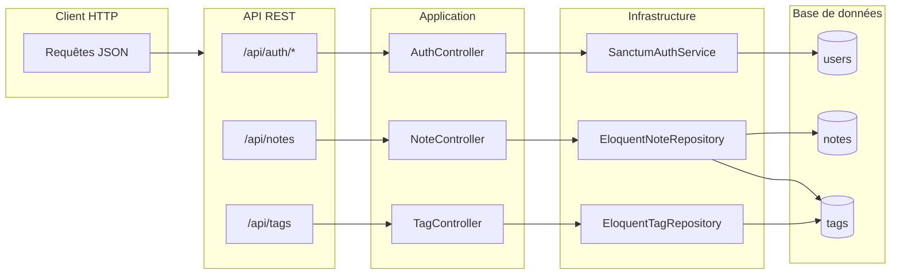

# Analyse de l'application Architecture Cible (API Renote)

## 1. Fonctionnalité principale et fichiers associés

### Vue d'ensemble

L'application est une **API REST** de prise de notes : les utilisateurs s'authentifient par token (Laravel Sanctum), puis peuvent gérer des **notes** (texte + tag obligatoire) et des **tags** (globaux). Il n'y a pas d'interface web : tout accès se fait via des requêtes HTTP vers les routes préfixées par `/api`.

---

### 1.1 Authentification (API)

| Action | Méthode | Route | Fichiers | Description |
|--------|---------|--------|----------|-------------|
| Connexion | `POST` | `/api/auth/login` | `routes/api.php`, `AuthController::login`, `LoginRequest`, `AuthServiceInterface`, `SanctumAuthService` | Email + mot de passe → token + user (JSON). Réponse 401 si identifiants invalides. |
| Déconnexion | `POST` | `/api/auth/logout` | `routes/api.php`, `AuthController::logout` | Invalidation du token (auth:sanctum). |
| Profil utilisateur | `GET` | `/api/auth/user` | `routes/api.php`, `AuthController::user` | Retourne l'utilisateur connecté (auth:sanctum). |

- **Contrôleur** : `src/Presentation/Http/Controllers/Api/AuthController.php`
- **Requête** : `src/Presentation/Http/Requests/LoginRequest.php` (email, password)
- **Port / Implémentation** : `src/Application/Ports/AuthServiceInterface.php`, `src/Infrastructure/Auth/SanctumAuthService.php`
- **Ressource** : `src/Presentation/Http/Resources/UserResource.php`

---

### 1.2 Gestion des notes (API)

| Action | Méthode | Route | Fichiers | Description |
|--------|---------|--------|----------|-------------|
| Liste des notes | `GET` | `/api/notes` | `routes/api.php`, `NoteController::index`, `NoteRepositoryInterface`, `EloquentNoteRepository` | Notes de l'utilisateur connecté (avec tag). Réponse 200 + `data` (collection) ; message « Aucune note » si vide. |
| Création | `POST` | `/api/notes` | `NoteController::store`, `CreateNoteRequest`, `NoteResource` | Corps : `text` (optionnel), `tag_id` (obligatoire, exists:tags,id). Réponse 201 + `data` (note créée). |
| Mise à jour | `PUT` | `/api/notes/{noteId}` | `NoteController::update`, `UpdateNoteRequest` | Corps partiel : `text`, `tag_id`. 404 si note inexistante ou non détenue par l'utilisateur. |
| Suppression | `DELETE` | `/api/notes/{noteId}` | `NoteController::destroy` | 404 si note inexistante ou non détenue. |

- **Contrôleur** : `src/Presentation/Http/Controllers/Api/NoteController.php`
- **Requêtes** : `src/Presentation/Http/Requests/CreateNoteRequest.php`, `src/Presentation/Http/Requests/UpdateNoteRequest.php`
- **Port / Implémentation** : `src/Application/Ports/NoteRepositoryInterface.php`, `src/Infrastructure/Persistence/EloquentNoteRepository.php`
- **Ressource** : `src/Presentation/Http/Resources/NoteResource.php`
- **Migration** : `database/migrations/2025_07_16_195507_create_notes_table.php` (table `notes` : user_id, tag_id, text)

Règles métier : les notes sont filtrées par `user_id` ; chaque note doit être associée à un tag existant.

---

### 1.3 Gestion des tags (API)

| Action | Méthode | Route | Fichiers | Description |
|--------|---------|--------|----------|-------------|
| Liste des tags | `GET` | `/api/tags` | `routes/api.php`, `TagController::index`, `TagRepositoryInterface`, `EloquentTagRepository` | Tous les tags (globaux). Réponse 200 + `data` ; message « Aucun tag » si vide. |
| Création | `POST` | `/api/tags` | `TagController::store`, `CreateTagRequest`, `TagResource` | Corps : `name` (obligatoire, string, max 255). Réponse 201 + `data`. |

- **Contrôleur** : `src/Presentation/Http/Controllers/Api/TagController.php`
- **Requête** : `src/Presentation/Http/Requests/CreateTagRequest.php`
- **Port / Implémentation** : `src/Application/Ports/TagRepositoryInterface.php`, `src/Infrastructure/Persistence/EloquentTagRepository.php`
- **Ressource** : `src/Presentation/Http/Resources/TagResource.php`
- **Migration** : `database/migrations/2025_07_16_195813_create_tags_table.php` (table `tags` : name)

Les tags sont globaux (pas de `user_id`) ; les notes référencent un tag existant via `tag_id`.

---

### 1.4 Récapitulatif par couche

| Couche | Fichiers principaux |
|--------|----------------------|
| **Routes API** | `routes/api.php` |
| **Contrôleurs** | `src/Presentation/Http/Controllers/Api/AuthController.php`, `NoteController.php`, `TagController.php` |
| **Requêtes** | `src/Presentation/Http/Requests/LoginRequest.php`, `CreateNoteRequest.php`, `UpdateNoteRequest.php`, `CreateTagRequest.php` |
| **Ressources** | `src/Presentation/Http/Resources/UserResource.php`, `NoteResource.php`, `TagResource.php` |
| **Ports (Application)** | `src/Application/Ports/AuthServiceInterface.php`, `NoteRepositoryInterface.php`, `TagRepositoryInterface.php` |
| **Infrastructure** | `src/Infrastructure/Auth/SanctumAuthService.php`, `src/Infrastructure/Persistence/EloquentNoteRepository.php`, `EloquentTagRepository.php` |
| **Modèles / BDD** | Modèles Eloquent (User, Note, Tag), `database/migrations/*_create_notes_table.php`, `*_create_tags_table.php` |
| **Injection** | `src/Providers/ArchitectureCibleServiceProvider.php` |

---

## 2. Fonctionnalités ajoutées (sécurité et robustesse)

Ces éléments ont été ajoutés par rapport au cœur métier pour renforcer la sécurité et limiter les abus.

### 2.1 Limitation de taux sur le login (rate limiting)

| Élément | Détail |
|--------|--------|
| **Objectif** | Réduire le risque d’attaques par force brute sur le mot de passe. |
| **Fichier** | `routes/api.php` |
| **Implémentation** | Middleware `throttle:5,1` sur la route `POST /api/auth/login`. |
| **Effet** | Au plus **5 tentatives de connexion par minute** par client (clé de throttle par défaut Laravel). Au-delà, réponse HTTP 429 (Too Many Requests). |

Aucun autre endpoint de l’API n’a de throttle spécifique dans le fichier de routes actuel (le throttle global du groupe API peut s’appliquer selon la configuration Laravel).

---

### 2.2 Limite de taille sur le champ `text` des notes

| Élément | Détail |
|--------|--------|
| **Objectif** | Éviter les payloads trop volumineux (risque DoS) et rester cohérent avec la capacité du type de colonne en base. |
| **Fichiers** | `src/Presentation/Http/Requests/CreateNoteRequest.php`, `src/Presentation/Http/Requests/UpdateNoteRequest.php` |
| **Implémentation** | Règle de validation `max:65535` sur le champ `text` (création et mise à jour). |
| **Effet** | Si `text` dépasse 65 535 caractères, la requête est rejetée avec une réponse 422 ; message personnalisé en création : « Le texte de la note ne peut pas dépasser 65535 caractères. » |

La valeur 65535 correspond à la taille maximale d’une colonne MySQL `TEXT`.

---

## 3. Schémas (Mermaid)

### 3.1 Flux API (auth + notes + tags)



### 3.2 Modèle de données

```mermaid
erDiagram
    users ||--o{ notes : "a"
    tags ||--o{ notes : "a"
    users {
        bigint id PK
        string name
        string email
        string password
        timestamps
    }
    notes {
        bigint id PK
        bigint user_id FK
        bigint tag_id FK
        text text "max 65535"
        timestamps
    }
    tags {
        bigint id PK
        string name "max 255"
        timestamps
    }
```

---

## 4. Fichier concerné

L’analyse ci-dessus est enregistrée dans **`ARCHITECTURE.md`** à la racine du projet. Ce document décrit la fonctionnalité principale de l’application (API REST Notes/Tags et authentification) et les fonctionnalités ajoutées (rate limiting sur le login, limite de longueur sur le texte des notes).
